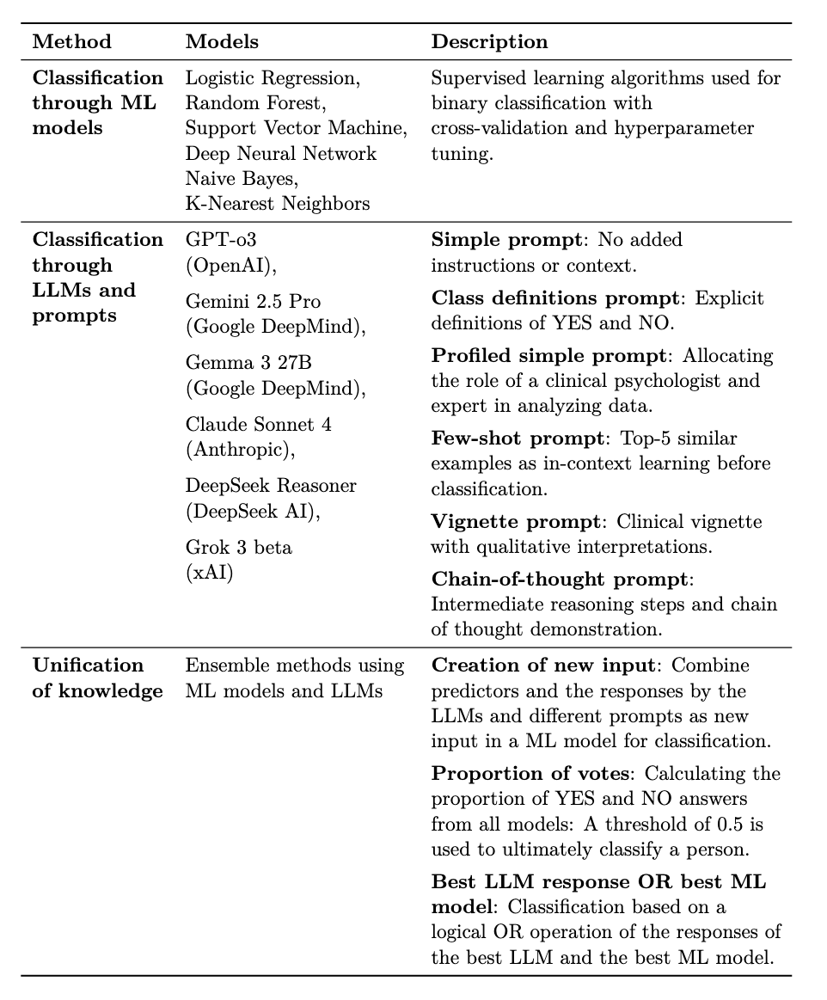

# Forecasting Psychological Disorders with LLMs and Machine Learning

This repo contains the code and data used for my master thesis "Forecasting Psychological Disorders with Large Language Models and Machine Learning", supervised by the Methods Center at the University of Tübingen and XXX.

This thesis evaluated ML algorithms, LLMs, and unification approaches for forecasting psychological disorder incidence between two time points, using an exemplary longitudinal psychological dataset.

**RQ1**: How does the performance of traditional ML models and classification through LLMs and prompts compare in forecasting the binary incidence of psychological disorders?

**RQ2**: How do unification approaches of ML and LLMs perform in forecasting the binary incidence of psychological disorders?

**RQ3**: Can ad hoc explanations generated by LLMs for misclassified cases improve the interpretability of predictions of psychological disorders and categorize reasons for failure?

---

## Structure

You will find the experiments I conducted in `.\exp`, the prompts I build, using the data (Dresden Predictor Study (DPS), a study about predictors of psychological disorders by Trumpf, Margraf, Vriends, Meyer, & Becker, 2010) in the directory `.\dat`, and the report and figures in `.\doc`.

---

## Methods

I compared **six ML models**, including linear, neural, probabilistic, tree-based, kernel-based and distance-based models, **six prompting strategies** across **six state-of-the-art LLMs** and **three unification approaches** combining ML and LLM strengths.

  

---

## Results

All experiments can be found in `.\exp`. `01_ML` contains all implemented ML models and their predictions, `02_LLM` contains the creation of prompts, all implemented LLM APIs, and their predictions, `03_Unification` contains the unification approaches and their predictions, and `04_Reasons_Misclassifications` contains the prompting for reasons of misclassifications. 

---

## Main Literature

Tavarez-Rodríguez, J., Sánchez-Vega, F., Rosales-Pérez, A., & López-Monroy, A. P. (2024, September 09–12). Better together: Llm and neural classification transformers to detect sexism. In _Clef 2024: Conference and labs of the evaluation forum_. Grenoble, France: CEUR Workshop Proceedings. Retrieved from http://ceur-ws.org/Vol-XXX/ (© 2024 Copyright for this paper by
its authors. Use permitted under Creative Commons License Attribution 4.0 International (CC BY 4.0))

Trumpf, J., Margraf, J., Vriends, N., Meyer, A. H., & Becker, E. S. (2010). Predictors of specific phobia in young women: A prospective community study. _Journal of Anxiety Disorders, 24 (1)_, 87-93. Retrieved from https://www.sciencedirect.com/science/article/pii/S0887618509001844 doi:https://doi.org/10.1016/j.janxdis.2009.09.002

 Data for: Dresden Predictor Study (DPS) of anxiety disorders and depression in young German Women is publically available at: https://www.psycharchives.org/en/item/dcd1536b-9b99-4ff1-a917-1f9e0528368b 
