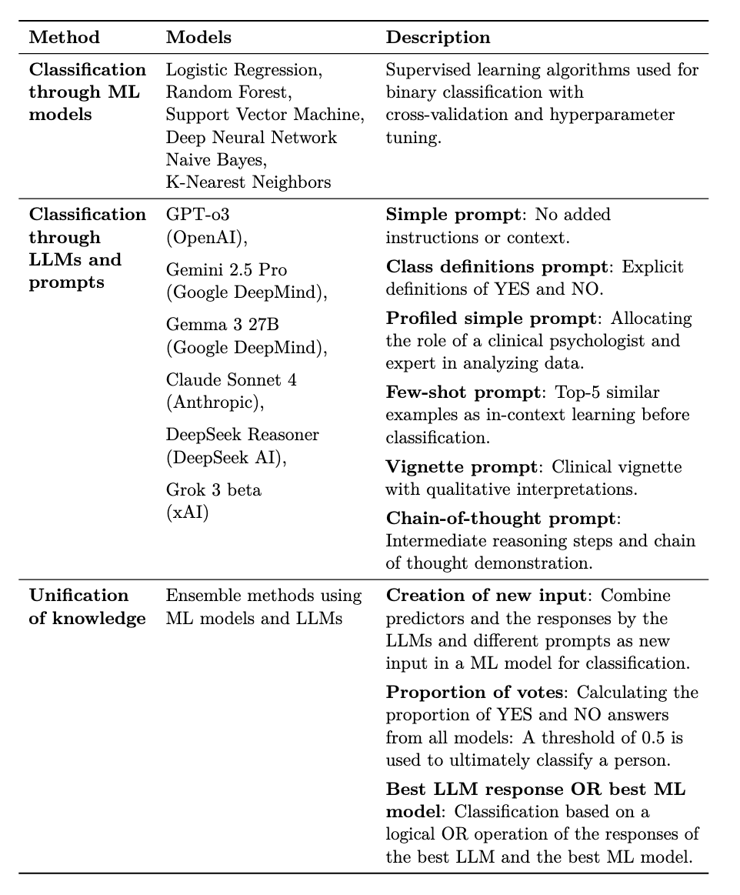
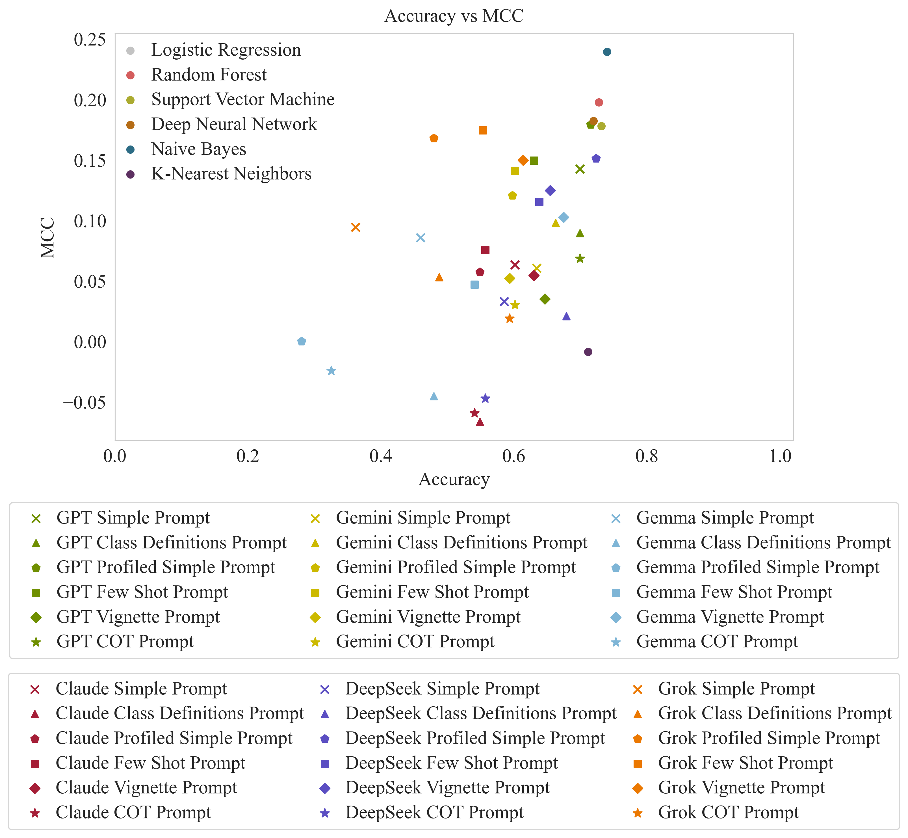
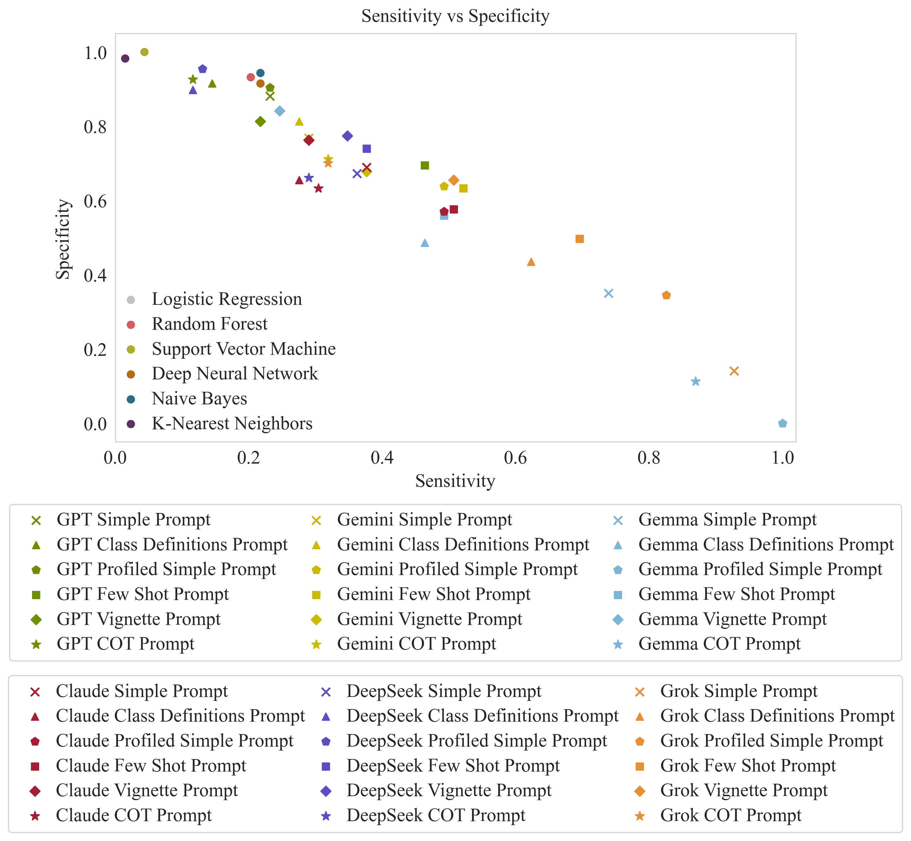
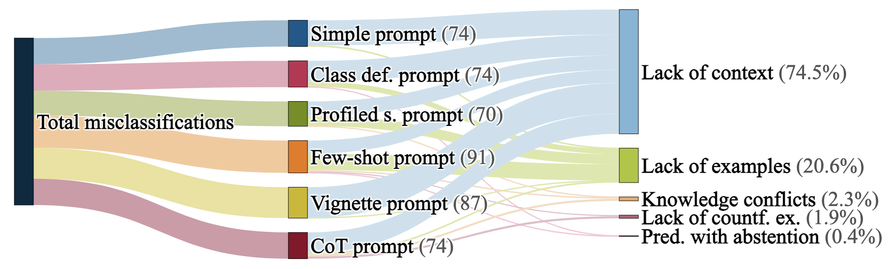

# Forecasting Psychological Disorders with LLMs and Machine Learning

This repo contains the code and data used for my master thesis "From Prompts to Predictions: Forecasting Psychological Disorders with Large Language Models and Machine Learning", supervised by the Methods Center at the University of Tübingen and Christopher Stewart, Computational Linguist at Google.

Psychological disorders affect a significant percentage of the global population, contributing to a global healthcare burden. Large language models (LLMs) have demonstrated remarkable capabilities in many fields, yet their potential for forecasting psychological disorder onset from numerical data remains unexplored. This thesis evaluated ML algorithms, LLMs, and unification approaches for forecasting psychological disorder incidence between two time points, using an exemplary longitudinal psychological dataset.

**RQ1**: How do traditional ML models and LLMs with prompts perform in terms of forecasting the binary incidence of psychological disorders?

**RQ2**: How do unification approaches of ML and LLMs perform in terms of forecasting the binary incidence of psychological disorders?

**RQ3**: Can post-hoc explanations generated by LLMs for misclassified cases improve the explainability and categorize reasons for failure?

---

## Structure

You will find the prompts and instructions I build in the directory `./dat`, the report and figures in `./doc` and the experiments I conducted in `./exp`. 
I used data was made publically available from the Dresden Predictor Study (DPS)1, a study about predictors of psychological disorders by Trumpf, Margraf, Vriends, Meyer, & Becker, 2010.

---

## Methods

I compared **six ML models**, including linear, neural, probabilistic, tree-based, kernel-based and distance-based models, **six prompting strategies** across **six state-of-the-art LLMs** and **three unification approaches** combining ML and LLM strengths. All experiments can be found in `./exp`. `01_ML` contains all implemented ML models and their predictions, `02_LLM` contains the creation of prompts, all implemented LLM APIs, and their predictions, `03_Unification` contains the unification approaches and their predictions, and `04_Reasons_Misclassifications` contains the prompting for reasons of misclassifications.

  

---

## Results

The evaluation and results for RQ1 can be found in `05_RQ1_Evaluation_Performance_ML_LLM.ipynb`, for RQ2 in `06_RQ2_Evaluation_Performance_Unification_Approaches.ipynb` and for RQ3 in `07_RQ3_Evaluation_Misclassifications.ipynb`.

**RQ1**

ML models outperformed LLMs in terms of accuracy and MCC, with Naive Bayes achieving the best performance. However, ML models showed a low sensitivity and were not able to correctly forecast the majority of psychological disorder onsets. While LLMs were in general not able to predict the correct class in as many cases as the ML models, they showed a more balanced sensitivity and specificity. Among LLMs, GPT and Grok performed best on average, with GPT showing the highest specificity and Grok best sensitivity. The profiled simple prompt, few-shot prompt and vignette prompt emerged as the most effective strategies. The best LLM implementation used GPT and a profiled simple prompt. The results reveal a trade-off between specificity and sensitivity, with none of the models excelling at both metrics. 

   &nbsp;&nbsp;&nbsp;&nbsp;&nbsp;&nbsp;&nbsp;&nbsp;&nbsp;&nbsp;&nbsp;&nbsp;&nbsp;&nbsp;
  

 

**RQ2**

Most unification approaches scored good performances. The creation of new input performed best, even performing a bit better than the best ML model, Naive Bayes when trained on the original predictors alone. This means that including LLM predictions in the training set as predictors increased the performance of ML models, even though only insignificantly. However, the remaining unification approaches were not able to perform better than the best performing ML models. Still, they were mostly able to score a more robust performance compared to the LLMs' performance. 

 

**RQ3**

LLMs were able to categorize reasons for failure, even though the reliability of such explanations may have varied across models and prompting strategies. While LLMs differ in their pattern of reasons for misclassifications, lack of context emerged as the most important reason. GPT, Gemma, Claude and Grok mentioned lack of context, Gemini knowledge conflicts and DeepSeek lack of opinion-based info most frequently as the primary reason for misclassifications. Simple prompts most often generated lack of context as reason for misclassification, while few-shot prompts generated lack of examples or counterfactual demonstrations. There is a predominance of lack of context, information or examples over knowledge conflicts and prediction with abstention.

  

<em>Sankey diagram showing reasons of misclassifications for GPT</em>

---

## Conclusion

The aim of this study was to investigated if LLMs are able to forecast the binary incidence of psychological disorder onsets. It showed that LLMs are able to forecast psychological disorder onset between two time points, although not outperform most ML methods in terms of their accuracy and MCC. While ML models lack high sensitivity and are not able to correctly forecast the majority of psychological disorder onsets, LLMs often show a more balanced sensitivity and specificity. Unification approaches of ML models and LLMs did not necessarily improve performance, but are a promising method for creating more robust results. Furthermore, LLMs were able to categorize misclassified cases into reasons of failure. While patterns and explanations vary across models and prompting strategies, lack of context was the most stated reason. Despite some important aspects that researchers should consider before employing LLMs, LLMs hold great potential for the analysis of numerical psychological data and forecasting of psychological disorders in real-time.

---

## Main Literature

Caruccio, L., Cirillo, S., Polese, G., Solimando, G., Sundaramurthy, S., & Tortora, G. (2024). Can chatgpt provide intelligent diagnoses? a comparative study between predictive models and chatgpt to define a new medical diagnostic bot. Expert Systems with Applications, 235 , 121186. Retrieved from https://www.sciencedirect.com/science/article/pii/S0957417423016883 doi: https://doi.org/10.1016/j.eswa.2023.121186

Tavarez-Rodríguez, J., Sánchez-Vega, F., Rosales-Pérez, A., & López-Monroy, A. P. (2024, September 09–12). Better together: Llm and neural classification transformers to detect sexism. In _Clef 2024: Conference and labs of the evaluation forum_. Grenoble, France: CEUR Workshop Proceedings. Retrieved from http://ceur-ws.org/Vol-XXX/ (© 2024 Copyright for this paper by
its authors. Use permitted under Creative Commons License Attribution 4.0 International (CC BY 4.0))

Trumpf, J., Margraf, J., Vriends, N., Meyer, A. H., & Becker, E. S. (2010). Predictors of specific phobia in young women: A prospective community study. _Journal of Anxiety Disorders, 24 (1)_, 87-93. Retrieved from https://www.sciencedirect.com/science/article/pii/S0887618509001844 doi:https://doi.org/10.1016/j.janxdis.2009.09.002

Wu, Y., Wang, Y., Wang, C., & Zheng, Z. (2024). Llm enhanced machine learning estimators for classification. In 2024 winter simulation conference (wsc) (p. 288-298). doi: 10.1109/WSC63780.2024.10838779

Zhou, W., Zhang, S., Poon, H., & Chen, M. (2023). Context-faithful prompting for large language models. Retrieved from https://arxiv.org/abs/2303.11315

--- 
1 Data for: Dresden Predictor Study (DPS) of anxiety disorders and depression in young German Women is publically available at: https://www.psycharchives.org/en/item/dcd1536b-9b99-4ff1-a917-1f9e0528368b
 
