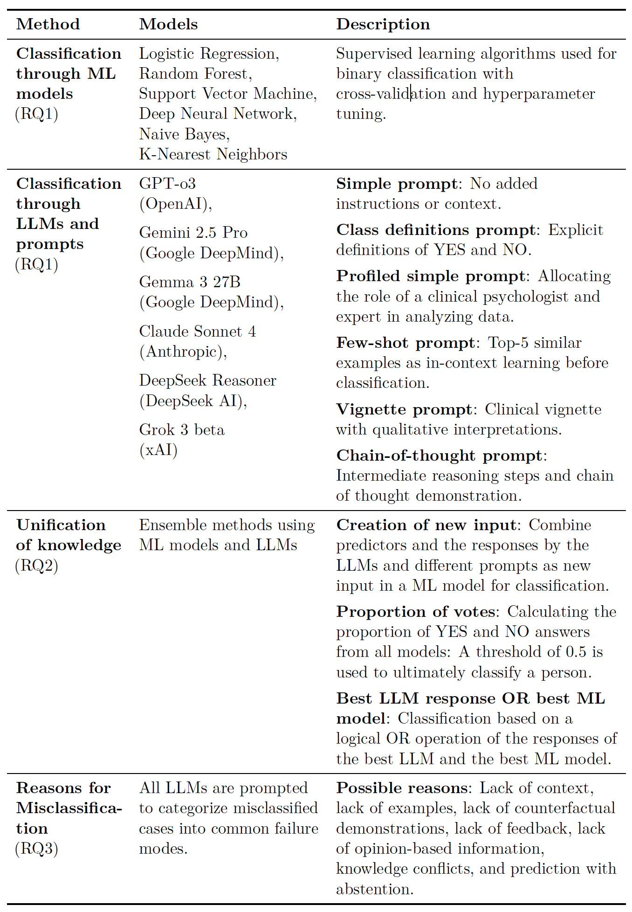

# Forecasting Psychological Disorders with LLMs and Machine Learning

This repo contains the code and data used for my master thesis "Forecasting Psychological Disorders with Large Language Models and Machine Learning", supervised by the Methods Center at the University of Tübingen and XXX.

This thesis evaluated ML algorithms, LLMs, and unification approaches for forecasting psychological disorder incidence between two time points, using an exemplary longitudinal psychological dataset.

---

## Structure

You will find the data I used (Dresden Predictor Study (DPS), a study about predictors of psychological disorders by Trumpf, Margraf, Vriends, Meyer, & Becker, 2010) and the prompts I build in the directory `.\dat`, the experiments I conducted in `.\exp` and the report and figures in `.\doc`.

---

## Methods

I compared **six ML models**, including linear, neural, probabilistic, tree-based, kernel-based and distance-based models, **six prompting strategies** across **six state-of-the-art LLMs** and **three unification approaches** combining ML and LLM strengths.

  

---

## Results

All experiments can be found in `.\exp`. `Documentation_RL_Project.ipynb` is a documentation of my experiments. `comparison_models.py` is a script for comparing the five different PPO modifications, `train.py` is a training loop for training the final model, `hyperparam_search.py` is a script for hyperparameter tuning, and `run_client.py` is a script used for the final tournament.

---

## Main Literature
